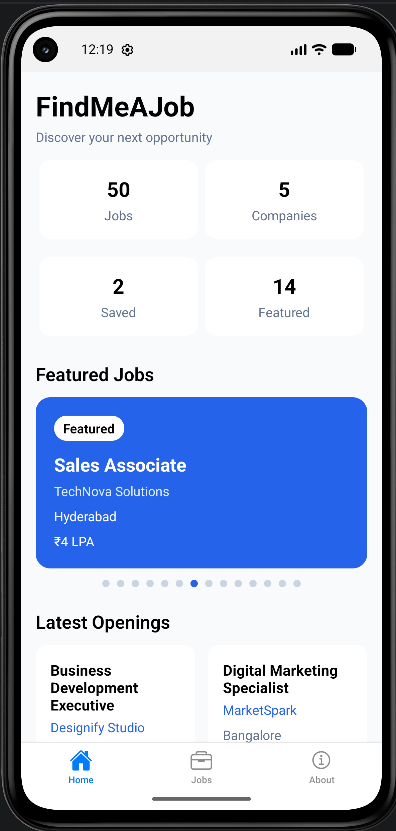
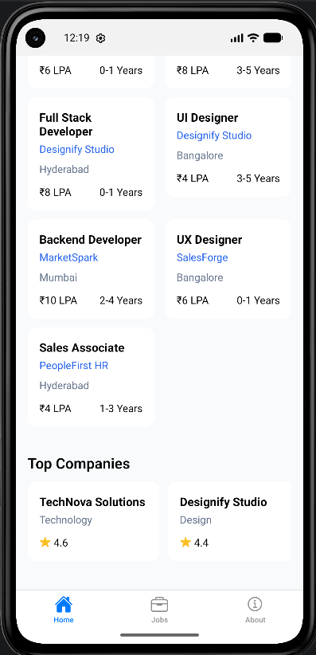
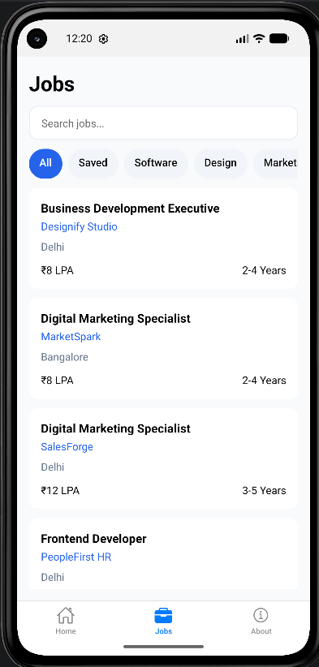
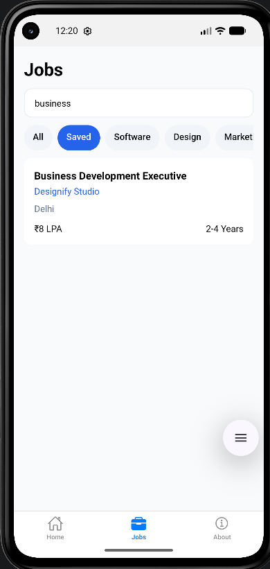
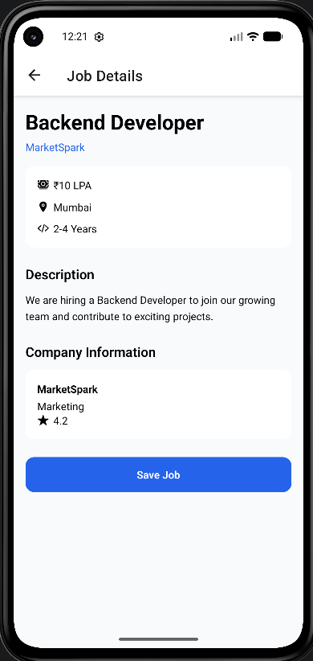
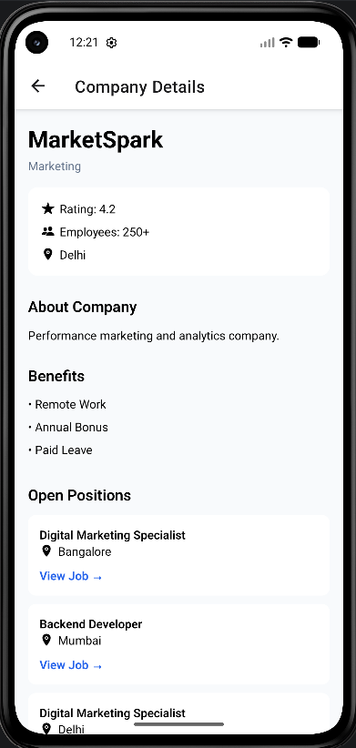
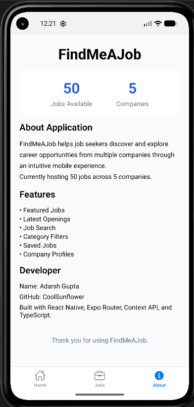

# FindMeAJob

## Project Description

FindMeAJob is a React Native mobile application designed to help users discover and explore job opportunities from various companies. The application provides a job-search experience through featured job recommendations, searchable job listings, detailed company profiles, job bookmarking functionality, and job information pages.

The application is built using React Native Functional Components and React Hooks, with a focus on reusable components, responsive layouts, and clean project architecture.

---

# Problem Statement

(This is slightly updated from original requirement to include additional company details page & job bookmarking feature)

Develop a Job Portal Mobile Application that enables users to browse job opportunities from different companies.

The application should:

- Display job listings
- Allow users to search available jobs
- Show detailed job information
- Provide company information
- Implement Bottom Tab Navigation
- Use reusable React Native components

---

# Features

## Core Features

### Home Screen

- Featured Jobs Carousel
- Latest Openings Section
- Top Companies Section
- Job Statistics Dashboard
- Quick navigation to job details

### Jobs Screen

- Search Jobs by title, company, or location
- Category-based filtering using selectable chips
- Responsive FlatList layout
- Compact reusable Job Cards

### Job Details Screen

- Complete job information
- Salary details
- Experience requirements
- Job description
- Company overview
- Save/Unsave Job functionality
- Navigate to Company Details Screen

### Company Details Screen

- Company profile information
- Industry information
- Company ratings
- Employee count
- Benefits offered
- List of open positions in the company

### About Screen

- Application information
- Features overview
- Developer information
- Technology stack information

---

# Additional Features

## Save Jobs

Users can bookmark jobs for future reference.

Features:

- Save Job from Job Details Screen
- Remove Saved Job
- Saved Jobs Count displayed on Home Screen Dashboard

---

## Company Profiles

Each company contains dedicated information including:

- Company Name
- Industry
- Location
- Company Description
- Employee Count
- Company Rating
- Benefits Offered

Users can navigate from Job Details Screen to Company Details Screen.

---

## Category-Based Job Filtering

Jobs can be filtered using category chips.

Examples:

- All
- Software Development
- Design
- Marketing
- Sales
- Human Resources

The selected chip visually highlights the active category.

---

## Job Statistics Dashboard

The Home Screen includes a dashboard displaying:

- Total Jobs
- Total Companies
- Saved Jobs
- Featured Jobs

This provides a quick overview of platform statistics.

---

# UI Screenshots












# Application Screens (Planned UI Design)

## 1. Home Screen

Purpose:
Serve as the landing page of the application.

Components:

- Header
- Featured Jobs Carousel
- Latest Openings Horizontal List
- Statistics Dashboard
- Top Companies Section

Layout:

```text
FindMeAJob
--------------------------------
Statistics
--------------------------------

+----------+ +----------+
| Jobs     | |Companies |
+----------+ +----------+

+----------+ +----------+
| Saved    | |Featured  |
+----------+ +----------+

--------------------------------
Featured Jobs
--------------------------------

[ Featured Job Carousel ]

--------------------------------
Latest Openings
--------------------------------

[ Horizontal Job Cards ]

--------------------------------
Top Companies
--------------------------------

[ Company Cards ]
```

---

## 2. Jobs Screen

Purpose:
Allow users to browse and search all available jobs.

Components:

- Search Bar
- Category Chips
- FlatList of Jobs

Layout:

```text
Jobs
--------------------------------

[ Search Jobs... ]

--------------------------------

[All][Saved][Software][Design]
[Marketing][Sales][HR]

--------------------------------

+--------------------+
| Job Card           |
+--------------------+

+--------------------+
| Job Card           |
+--------------------+
```

---

## 3. Job Details Screen

Purpose:
Display complete information about a selected job.

Components:

- Job Header
- Salary Information
- Experience Requirement
- Description
- Company Information
- Save Job Button
- View Company Button

Layout:

```text
< Back

Frontend Developer

CompanyName

Salary
₹10,00,000

Experience
2-4 Years

--------------------------------
Description
--------------------------------

Job description content...

--------------------------------
Company Information
--------------------------------

CompanyName
Rating: 4.6

[ View Company ]

--------------------------------

[ Save Job ]
```

---

## 4. Company Details Screen

Purpose:
Display detailed information about a company.

Components:

- Company Information
- Rating
- Benefits
- Open Positions

Layout:

```text
< Back

TechNova Solutions

Technology Industry

Rating: 4.6

Employees:
500+

--------------------------------
About Company
--------------------------------

Company description...

--------------------------------
Benefits
--------------------------------

• Health Insurance
• Flexible Hours
• Remote Work

--------------------------------
Open Positions
--------------------------------

Frontend Developer
Backend Developer
UI Designer
```

---

## 5. About Screen

Purpose:
Provide information about the application and developer.

Layout:

```text
About FindMeAJob

Version 1.0.0

--------------------------------

FindMeAJob helps job seekers
discover opportunities from
multiple companies.

--------------------------------

Developer Information

Name:
Adarsh Gupta

GitHub:
CoolSunflower

--------------------------------

Thank You For Using FindMeAJob
```

---

# Reusable Components

## JobCardCompact

Used in:

- Jobs Screen
- Latest Openings Section

Displays:

- Job Title
- Company Name
- Location
- Salary
- Experience

---

## JobCardFeatured

Used in:

- Featured Jobs Carousel

Displays:

- Featured Badge
- Job Title
- Company Name
- Salary
- Experience
- Location

---

## CompanyCard

Used in:

- Home Screen
- Company Details Screen

Displays:

- Company Name
- Industry
- Rating

---

## SearchBar

Reusable search component used in:

- Home Screen
- Jobs Screen

---

## CategoryChip

Reusable filter chip component.

States:

- Selected
- Unselected

Used for category filtering.

---

## StatCard

Reusable dashboard card displaying statistics.

Used in:

- Home Screen

Examples:

- Total Jobs
- Total Companies
- Saved Jobs
- Featured Jobs

---

# Data Model

## Company Type

```typescript
type Company = {
  id: string;
  name: string;
  industry: string;
  location: string;
  description: string;
  employeeCount: string;
  rating: number;
  benefits: string[];
};
```

---

## Job Type

```typescript
type Job = {
  id: string;
  title: string;
  companyId: string;
  location: string;
  salary: string;
  experience: string;
  category: string;
  description: string;
  featured: boolean;
  latest: boolean;
};
```

---

## Application State

```typescript
type AppState = {
  companies: Company[];
  jobs: Job[];
  savedJobIds: string[];
};
```

---

# Navigation Structure

The application uses React Navigation.

```text
Root Stack
│
├── Bottom Tabs
│   ├── Home
│   ├── Jobs
│   └── About
│
├── Job Details
│
└── Company Details
```

---

# State Management

The application uses React Context API.

Responsibilities:

- Manage jobs data
- Manage companies data
- Manage saved jobs
- Handle search functionality
- Handle category filtering
- Provide helper functions across screens

---

# Technology Stack

- React Native
- TypeScript
- React Navigation
- React Context API
- React Hooks
- FlatList
- ScrollView

---

# Installation & Setup

```bash
## Clone Repository
git clone https://github.com/CoolSunflower/FindMeAJob.git

## Navigate To Project
cd FindMeAJob

## Install Dependencies
npm install

## Start Metro Bundler
npm start

## Run Android Application
npm run android
```
